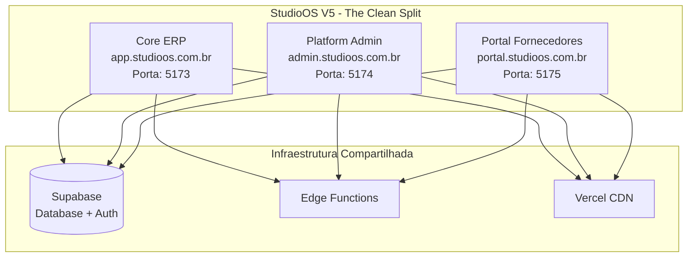

# StudioOS Architecture - V5 The Clean Split

**Versão:** 5.0.0  
**Data:** 2026-01-30  
**Status:** Production

---

## Visão Geral

O StudioOS V5 adota a arquitetura **"The Clean Split"** - uma separação clara entre três aplicações especializadas, cada uma servindo um público específico com seu próprio build e deploy.



---

## Aplicações

### 1. Core ERP (@studioos/core)

**Responsabilidade:** Gestão operacional completa para decoradoras

| Aspecto | Detalhe |
|---------|---------|
| **Domínio** | app.studioos.com.br |
| **Porta Dev** | 5173 |
| **Público** | Usuários finais (decoradoras) |
| **Funcionalidades** | Orçamentos, Pedidos, Produção, Financeiro |

**Páginas Principais:**
- `/login` - Autenticação
- `/dashboard` - Dashboard operacional
- `/orcamentos` - Lista de orçamentos
- `/orcamentos/novo` - Wizard de criação (4 passos)
- `/pedidos` - Gestão de pedidos
- `/financeiro` - Contas a pagar/receber

**Estrutura:**
```
apps/core/src/
├── components/
│   ├── ui/              # Button, Card, Input, Select
│   ├── wizard/          # StepIndicator, WizardProgress
│   │   └── steps/       # StepCliente, StepProdutos, StepServicos, StepResumo
│   ├── AppLayout.tsx    # Layout principal
│   ├── ProtectedRoute.tsx
│   └── Sidebar.tsx
├── hooks/
│   ├── useAuth.tsx      # Context + Provider
│   ├── useOrcamentos.ts
│   ├── useDashboardStats.ts
│   ├── useOrcamentoWizard.ts
│   └── useCriarOrcamento.ts
├── lib/
│   ├── supabase.ts      # Cliente Supabase
│   ├── utils.ts         # cn() helper
│   └── calculations.ts  # Cálculos de orçamento
└── pages/
    ├── LoginPage.tsx
    ├── DashboardPage.tsx
    ├── OrcamentosPage.tsx
    └── NovoOrcamentoPage.tsx
```

### 2. Platform Admin (@studioos/platform)

**Responsabilidade:** Administração da plataforma para super admins

| Aspecto | Detalhe |
|---------|---------|
| **Domínio** | admin.studioos.com.br |
| **Porta Dev** | 5174 |
| **Público** | Super administradores |
| **Funcionalidades** | Gestão de organizações, planos, fornecedores |

**Páginas Principais:**
- `/login` - Autenticação admin
- `/dashboard` - Métricas da plataforma
- `/organizations` - Gestão de organizações
- `/users` - Gestão de usuários
- `/suppliers` - Aprovação de fornecedores
- `/plans` - Configuração de planos

**Estrutura:**
```
apps/platform/src/
├── components/
│   ├── ConfigError.tsx
│   ├── PlatformLayout.tsx
│   └── ProtectedRoute.tsx
├── hooks/
│   ├── AuthProvider.tsx
│   ├── useAuth.ts
│   └── usePlatformStats.ts
├── lib/
│   ├── supabase.ts
│   └── utils.ts
└── pages/
    ├── LoginPage.tsx
    ├── DashboardPage.tsx
    ├── OrganizationsPage.tsx
    ├── UsersPage.tsx
    ├── SuppliersPage.tsx
    └── PlansPage.tsx
```

### 3. Portal Fornecedores (@studioos/portal)

**Responsabilidade:** Portal self-service para fornecedores

| Aspecto | Detalhe |
|---------|---------|
| **Domínio** | portal.studioos.com.br |
| **Porta Dev** | 5175 |
| **Público** | Fornecedores cadastrados |
| **Funcionalidades** | Catálogo, pedidos, perfil |

**Páginas Principais:**
- `/login` - Autenticação fornecedor
- `/dashboard` - Dashboard do fornecedor
- `/catalogo` - Gerenciamento de catálogo
- `/pedidos` - Pedidos recebidos
- `/perfil` - Configurações do perfil

**Estrutura:**
```
apps/portal/src/
├── components/
│   ├── ConfigError.tsx
│   ├── PortalLayout.tsx
│   └── ProtectedRoute.tsx
├── hooks/
│   ├── AuthProvider.tsx
│   ├── useAuth.ts
│   └── useSupplierStats.ts
├── lib/
│   ├── supabase.ts
│   └── utils.ts
└── pages/
    ├── LoginPage.tsx
    ├── DashboardPage.tsx
    ├── CatalogoPage.tsx
    ├── PedidosPage.tsx
    └── PerfilPage.tsx
```

---

## Infraestrutura Compartilhada

### Supabase

**Projeto:** `tjwpqrlfhngibuwqodcn`

**Serviços Utilizados:**
- **Auth:** Autenticação JWT para todas as apps
- **Database:** PostgreSQL com RLS (Row Level Security)
- **Edge Functions:** Serverless functions

**Edge Functions:**
```
supabase/functions/
├── calculate-mrr/           # Cálculo de MRR
├── check-production-delays/ # Verificação de atrasos
├── generate-recurring-bills/# Geração de faturas
├── send-lead-to-monday/    # Integração Monday.com
├── update-feature-flag/    # Atualização de flags
└── update-overdue-status/  # Atualização de status
```

### Schema do Banco

**Tabelas Principais:**
- `users` - Usuários do sistema
- `organizations` - Organizações (decoradoras)
- `suppliers` - Fornecedores
- `orcamentos` - Orçamentos
- `pedidos` - Pedidos de produção
- `contas_receber` / `contas_pagar` - Financeiro
- `feature_flags` - Feature flags
- `domains` / `subdomains` - Configuração de domínios

**Migrations:**
```
infra/migrations/
├── 00000000000000_baseline_schema.sql    # Schema consolidado
├── 00000000000001_initial_seed.sql       # Dados iniciais
└── archive/                              # 140+ migrations históricas
```

---

## Padrões de Código

### Autenticação

Todas as apps usam o mesmo padrão de autenticação Supabase:

```typescript
// lib/supabase.ts
import { createClient } from '@supabase/supabase-js';

const supabaseUrl = import.meta.env.VITE_SUPABASE_URL || 'fallback-url';
const supabaseKey = import.meta.env.VITE_SUPABASE_ANON_KEY || 'fallback-key';

export const supabase = createClient(supabaseUrl, supabaseKey);
```

### Protected Routes

```typescript
// components/ProtectedRoute.tsx
export function ProtectedRoute({ children }: { children: ReactNode }) {
  const { user, loading } = useAuth();
  
  if (loading) return <Loading />;
  if (!user) return <Navigate to="/login" />;
  
  return children;
}
```

### Data Fetching

Uso de TanStack Query (React Query) para todas as operações:

```typescript
// hooks/useOrcamentos.ts
export function useOrcamentos() {
  return useQuery({
    queryKey: ['orcamentos'],
    queryFn: async () => {
      const { data, error } = await supabase
        .from('orcamentos')
        .select('*');
      if (error) throw error;
      return data;
    }
  });
}
```

---

## Deploy

### Vercel

Cada app tem seu próprio deploy na Vercel:

| App | URL de Produção | Branch |
|-----|-----------------|--------|
| Core | core-*.vercel.app | main |
| Platform | platform-*.vercel.app | main |
| Portal | portal-*.vercel.app | main |

### Scripts de Deploy

```bash
# Deploy todas as apps
./DEPLOY_ALL_APPS_FIXED.bat

# Ou usando PowerShell
./DEPLOY_ALL_APPS_FIXED.ps1

# Ou shell script
./scripts/v5-deploy-all.sh
```

---

## Roadmap de Evolução

### Fase 1: Shared Package (Curto prazo)

Criar `packages/shared/` para código comum:
- Componentes UI
- Hooks de autenticação
- Cliente Supabase
- Utilidades

### Fase 2: Workspace Unificado (Médio prazo)

Migrar para monorepo com workspaces:
```
studioos/
├── apps/
│   ├── core/
│   ├── platform/
│   └── portal/
├── packages/
│   ├── shared-ui/
│   ├── shared-hooks/
│   └── shared-lib/
└── package.json (workspace root)
```

### Fase 3: Deprecação V4 (Longo prazo)

Remover completamente o código legado em `src/`.

---

## Convenções

### Nomenclatura
- **Components:** PascalCase (ex: `Button.tsx`)
- **Hooks:** camelCase com prefixo `use` (ex: `useAuth.ts`)
- **Utils:** camelCase (ex: `utils.ts`)
- **Pages:** PascalCase com sufixo `Page` (ex: `DashboardPage.tsx`)

### Estilos
- **Framework:** Tailwind CSS
- **Componentes UI:** Baseados em Radix UI
- **Ícones:** Lucide React
- **Animações:** Tailwind Animate

### TypeScript
- **Strict Mode:** Ativado
- **Path Mapping:** `@/` aponta para `./src/`
- **Types:** Definidos em `src/types/` ou inline

---

## Segurança

### RLS (Row Level Security)

Todas as tabelas têm RLS ativado com políticas específicas:

```sql
-- Exemplo: Política para orcamentos
CREATE POLICY "Users can only see their org orcamentos"
ON orcamentos FOR SELECT
USING (organization_id IN (
  SELECT organization_id FROM organization_members 
  WHERE user_id = auth.uid()
));
```

### Roles

- `user` - Usuário padrão
- `admin` - Administrador da organização
- `super_admin` - Administrador da plataforma
- `supplier` - Fornecedor

---

## Monitoramento

### Edge Functions
- Logs em tempo real no Supabase Dashboard
- Métricas de execução

### Database
- Query performance insights
- RLS policy checks

### Aplicações
- Vercel Analytics (opcional)
- Console errors

---

## Documentação Relacionada

- [V5 Deploy Guide](./V5_DEPLOY_GUIDE.md)
- [V5 Migration Guide](./V5_MIGRATION_GUIDE.md)
- [Feature Flags Usage](./FEATURE_FLAGS_USAGE.md)
- [Contextualização Crítica V5](./CONTEXTUALIZACAO_CRITICA_V5.md)

---

**Mantido por:** StudioOS Team  
**Última atualização:** 2026-01-30
